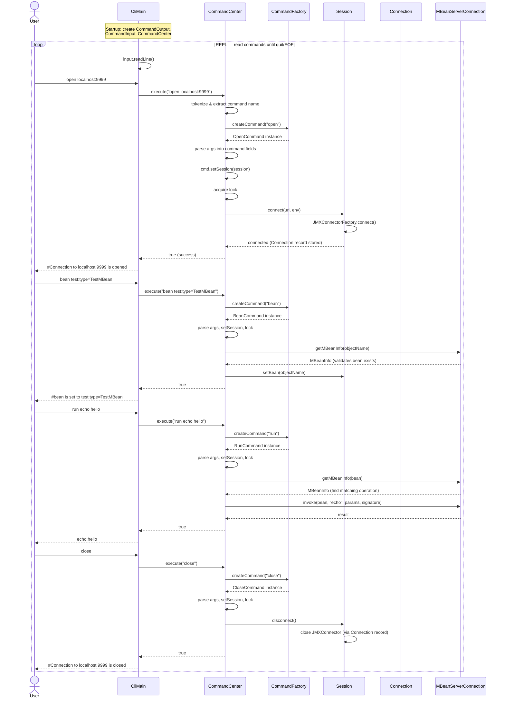

# Architecture

This document describes the internal architecture of jmxsh, focusing on the components involved in
the command execution flow.

## Command Execution Flow

The diagram below shows the sequence of interactions when a user runs the `open`, `bean`, `run`, and
`close` commands in a typical jmxsh session.

## Component Descriptions

### CliMain

The application entry point (`sh.jmx.jmxsh.boot.CliMain`). Parses CLI arguments (e.g.
`-l` for URL, `-n` for non-interactive mode, `-q` for quiet/silent output mode), initializes the I/O layer and
`CommandCenter`, then enters the REPL loop that reads and dispatches user commands.

### CommandCenter

The central orchestrator (`sh.jmx.jmxsh.cc.CommandCenter`). Responsible for:

- **Parsing** raw command strings (handling comments `#`, chaining with `&&`, and argument
  tokenizing)
- **Creating** command instances via `CommandFactory`
- **Injecting** the `Session` into each command before execution
- **Thread-safe execution** using a `ReentrantLock` so commands run sequentially

### CommandFactory

A factory interface (`sh.jmx.jmxsh.CommandFactory`) implemented by
`PredefinedCommandFactory`. Discovers command name → class mappings from a static `COMMAND_CLASSES`
list at startup, reading the `@CommandLine.Command` annotation's `name` and `aliases` fields to
build the lookup map. Creates a fresh command instance for each execution.

### Command

The abstract base class (`sh.jmx.jmxsh.Command`) that all commands extend. Each
subclass:

- Is annotated with `@CommandLine.Command(name="...")` for registration
- Defines options via `@Option` and positional arguments via `@Parameters` on fields
- Implements `execute()` to perform its JMX operation
- Is **transient** — a new instance is created per execution (not reused)

### Session

A concrete class (`sh.jmx.jmxsh.Session`) that holds the current JMX state:

- The active `Connection` (JMX connector + URL)
- The currently selected domain and bean
- The output mode (`OutputMode`)
- References to `CommandOutput` for writing results and messages

`Session` owns the connect/disconnect lifecycle, calling `JMXConnectorFactory.connect()` directly.
It wraps the `CommandOutput` in a `VerboseCommandOutput` decorator that filters output based on
the current `OutputMode`. It is **not thread-safe** — all access is synchronized through
`CommandCenter`'s lock.

### Connection

A record (`sh.jmx.jmxsh.Connection`) wrapping a `JMXConnector` and `JMXServiceURL`. Provides
access to the `MBeanServerConnection`, the connection URL, and the connector ID. Created when
`Session.connect()` is called and nulled out on `Session.disconnect()`.

Both RMI (`service:jmx:rmi://...`) and JMXMP (`service:jmx:jmxmp://...`) protocols are supported.
`JMXConnectorFactory` auto-discovers the appropriate connector provider via the Java service loader
mechanism — the JMXMP provider is bundled in the uber JAR.

### MBeanServerConnection

The standard JMX interface (`javax.management.MBeanServerConnection`) obtained from the
`JMXConnector`. Commands use it to:

- Query MBean info (`getMBeanInfo`)
- Read/write attributes (`getAttribute`, `setAttribute`)
- Invoke operations (`invoke`)
- List domains and beans (`getDomains`, `queryNames`)

### I/O Layer

Abstractions for input and output (`sh.jmx.jmxsh.io`):

- **CommandInput** — reads user commands. Implementations: `JlineCommandInput` (interactive console
  with tab completion and history), `FileCommandInput` (script files), `InputStreamCommandInput`
  (piped input)
- **CommandOutput** — writes results and messages. `VerboseCommandOutput` is a decorator that
  filters output based on `OutputMode` (SILENT or BRIEF)

### JavaProcessManager

Discovers local JVM processes for the `jvms` command and PID-based `open` connections
(`sh.jmx.jmxsh.jdk9.JavaProcessManager`). Uses the `VirtualMachine` Attach API to list
running JVMs and can attach a JMX management agent to a process by PID.
